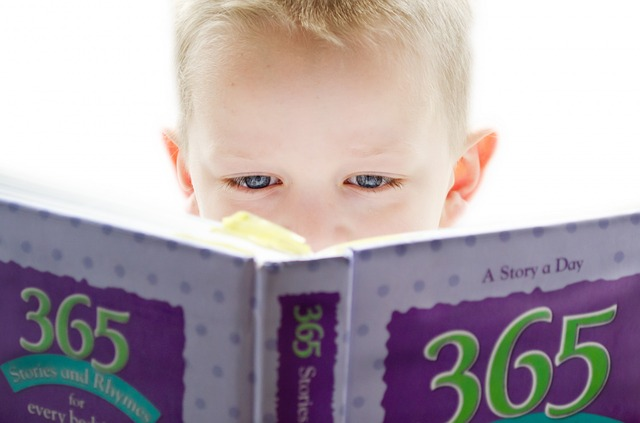

# Fizz-Buzz
**Week 2 of learning how to code.** 
We explore working with Ruby and Test Driven Development by building the children's game called *FizzBuzz*. The game can also occur as a coding challenge in job interviews.

### Fizz-Buzz
...is a game for children learn division. Players take turns counting up from one, replacing any number that is divisible by three with the word *'fizz'*, any number divisible by five with the word *'buzz'*, and any number divisible by both three and five to be replaced with *'fizz buzz'*.

*More information below the image.*

### Assignment
**When user puts in a number it returns:**
* “Fizz” if the number is divisible by 3
* “Buzz” if the number is divisible by 5
* “Fizz buzz” if the number is divisible by 15
* The same number if no other requirement is fulfilled
* An "Uh-Oh" message if the input is a word (sad path)

### Programs practiced in this challenge
* **Coding**
: | Ruby on Rails |
* **Testing**
: | Rspec |
* **Launching**
: | GitHub |
* **Other**
: | VSCode |

## Authors
* **Karolina Frostare** has built this application
* **[Craft Academy](https://www.craftacademy.se/english/)** has created this challenge and provided the learning material needed to accept it

## Acknowledgments
* The image used was (royalty) free and provided by [Pixabay.com](https://pixabay.com/)
* This assignment was provided by [Craft Academy](https://www.craftacademy.se/english/)
